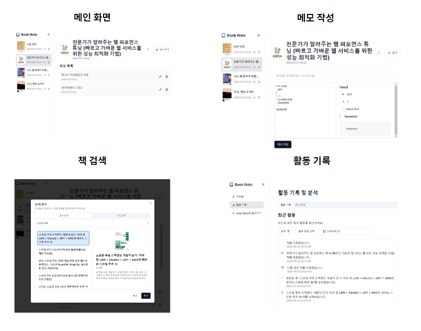
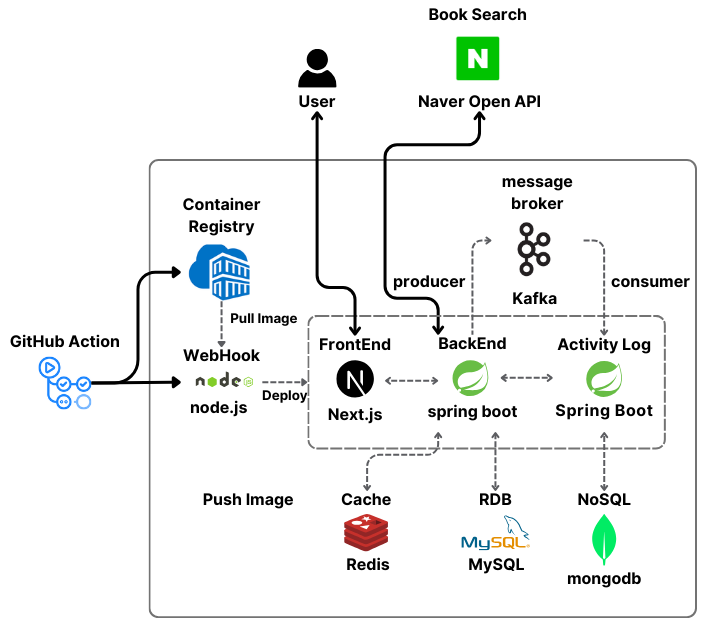

# BookNote-Server

### 목차

### 프로젝트 소개

**URl:** https://booknote.site

책을 읽는 동안 떠오르는 다양한 생각들을 손쉽게 기록하고, 체계적으로 정리할 수 있는 웹 서비스입니다. 

#### GitHub

- FrontEnd :  [BookNote Front](https://github.com/ghals5737/BookNote-Front/tree/main/booknote)
- BackEnd :  [BookNote BackEnd](https://github.com/ghals5737/BookNote-Server/tree/main/booknote)
- Activity-Log :  [BookNote Activity Log](https://github.com/ghals5737/BookNote-LogServer)

#### 화면 구성

### 기술스택

- Spring boot
- JPA / Hibernate
- Mysql
- Redis
- Kafka
- Docker
- Scheduler

### 아키텍쳐 

### 기능 구현 및 트러블 슈팅

- [JWT를 활용한 실시간 인증 인가 처리](https://github.com/ghals5737/BookNote-Server/wiki/JWT%EB%A5%BC-%EC%82%AC%EC%9A%A9%ED%95%9C-%EC%9D%B8%EC%A6%9D-%EC%9D%B8%EA%B0%80-%EC%B2%98%EB%A6%AC)
- [Naver Open API를 이용한 책검색](https://github.com/ghals5737/BookNote-Server/wiki/Naver-Open-API%EB%A5%BC-%EC%9D%B4%EC%9A%A9%ED%95%9C-%EC%B1%85%EA%B2%80%EC%83%89)
- [활동 기록 조회 기능](https://github.com/ghals5737/BookNote-Server/wiki/%ED%99%9C%EB%8F%99-%EA%B8%B0%EB%A1%9D-%EC%A1%B0%ED%9A%8C-%EA%B8%B0%EB%8A%A5)
- 책,메모 CRUD 구현
- [책순서 업데이트 기능](https://github.com/ghals5737/BookNote-Server/wiki/%EC%B1%85%EC%88%9C%EC%84%9C-%EC%97%85%EB%8D%B0%EC%9D%B4%ED%8A%B8-%EA%B8%B0%EB%8A%A5)
- JUNIT 테스트

### ERD

#### 

