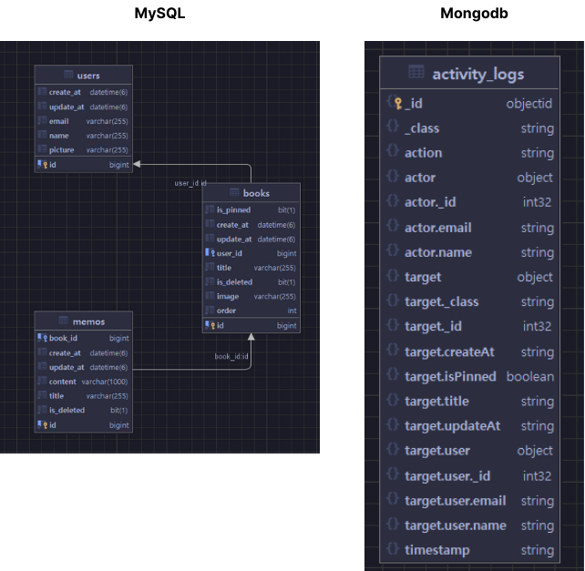

# BookNote-Server

### 목차

### 프로젝트 소개

책을 읽는 동안 떠오르는 다양한 생각들을 손쉽게 기록하고, 체계적으로 정리할 수 있는 웹 서비스입니다. 

거기에 백엔드 rest api 프로젝트이빈다.

#### GitHub

#### 화면 구성

### 기술스택

- Spring boot
- JPA / Hibernate
- Mysql
- Redis
- Kafka
- Docker
- Scheduler

### 아키텍쳐 

### 기능 구현 및 트러블 슈팅

- JWT를 활용한 실시간 인증 인가 처리
- Naver Open API를 이용한 책검색
- 활동 기록 조회 기능
- 책,메모 CRUD 구현
- 책순서 업데이트 기능
- JUNIT 테스트

### ERD

#### 

